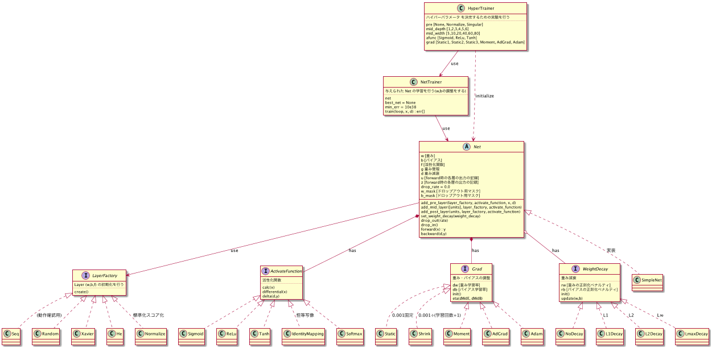
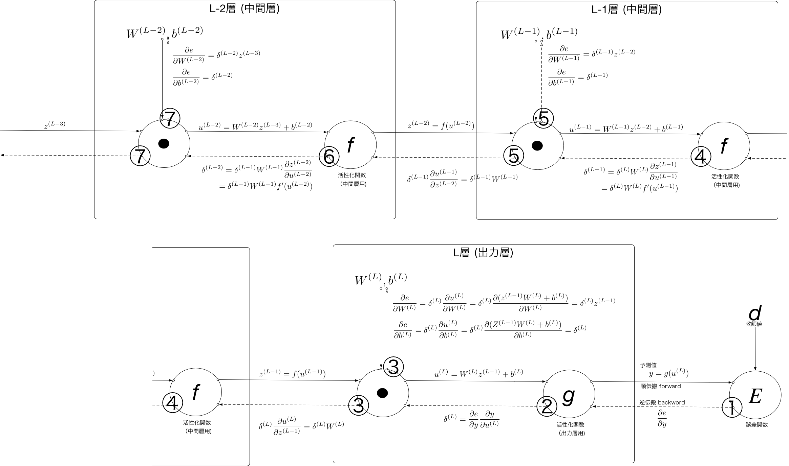

# ai-chan
the machine learning library for education

## 1.ai-chan の目的
* ai-chan は、深層学習(deep learning)を学習するためのライブラリです
* 深層学習を理解しやすいように実装上冗長な部分があります
  * 深層学習の教科書の層番号と、実装上の配列の添字が合うようにに合うようになっています。
重み行列のリスト W[] とバイアスベクトルのリスト b[] の添字には1から始まる層番号
とおなじになっています。W[0] b[0] にはNoneが設定されています。
  * 行列の内部形式も実装上の効率よりもわかりやすさを優先させています。データは 1 列が
1 つのデータの組を表します。順伝搬は次のように実装されます
```
    |w11 w12 w13| |-→  -→  -→        -→|   |b11|
u = |w21 w22 w23| |x1, x2, x3, ... , xN| + |b21|
    |w31 w32 w33| |                    |   |b31|
    |w41 w42 w43|                          |b41|
```
* 深層学習に使われるアルゴリズムは、モジュール構成になっており簡単に学習器に取り付けたり、
取り外したりできるようになっています
## 2.全体構造

* HyperTrainer (★未実装)
    * 学習のためのパラメータ (Hyper Parameter) の検証を行います
      1. 様々なハイパーパラメータを設定した Net を作成します
      1. NetTranier を使って Net の 重み(W) バイアス(b) を調整(学習)します
      1. 学習結果を比較して、最適なハイパーパラメータを見つけます
    * 実験計画法に基づいて効率的にハイパーパラメータの組み合わせを作成し、
      最小の実験回数で妥当なハイパーパラメータの組み合わせを見つけだします
* NetTrainer
    * ネットワークの重み(W)とバイアス(b)の調整を行います
    * 訓練データは 5 分割されて、一つは評価用に使います。残りの 4 つを順繰りに使って学習を行います。
* Net
    * ニューラルネットワークの実装です
    * 基本機能
      * [x] 順伝搬 forward()
      * [x] 逆伝搬 backward()
      * [x] 重み調整 adjust()
      * [ ] dropout dropout() dropin() (★未実装)
    * 上記の基本機能で使われるアルゴリズムやテクニックは、特定のインタフェースを実装した
      クラスを組み込みます。このようにすることにより、問題に即したアルゴリズムに組み替えたり、
      新しいアルゴリズムを簡単に試すことができます
      * 中間層の初期化には、LayerFactory インタフェースの実装クラスを使います
      * 活性化関数には、ActivateFunction インタフェースの実装クラスを使います
      * 学習率は、Grad インタフェースの実装クラスを使います
      * 重み減衰は WeightDecay インタフェースのに実装クラスを使います
    * 次の実装があります
      * [x] SimpleNet
      * [ ] RNNNet : 再帰形ニューラルネット(★未実装)
      * [ ] CombolutionNet 畳み込みニューラルネット(★未実装)
* LayerFactory
    * レイヤの初期化を行います
    * 次の実装があります
      * [x] Seq : [[1,2,3],[4,5,6],[7,8,9]] のように、重みWijにシーケンス値を設定します。順伝搬、逆伝搬のデバック用です。
      * [x] Random : 1レイヤ分をランダム(平均0, 分散1)に初期化します
      * [x] Xavier : 1レイヤ分をランダム(平均0, 分散√入力ノード数)に初期化します
      * [x] He : 1レイヤ分をランダム(平均0, 分散√(入力ノード数/2))に初期化します。
      ReLuとともに用いられる。Reluは0以下切り捨てなので、Xavierの重みを2倍している。
      * [x] Normalize : 入力データを正規化(標準化スコア化)するような重み行列Wとバイアスbをレイヤの初期値として設定します。
* ActivateFunction
    * 活性化関数を実装します。実装クラスは次の機能を持ちます
      * [x] f.calc(x) : ベクトルxの各要素に対して活性化関数を計算します
      * [x] f.differential(x) : ベクトルxの各要素に対して活性化関数の微分値を計算します
      * [x] f.delta(d,y) : 出力層に活性化関数 f を使ったとき、教師地d、実測値y のときの δ(L) を求めます
      * [x] f.name() : 関数の名前を返します
    * 次の実装があります
      * [x] IdentityMapping : 恒等写像
      * [x] Sigmoid : シグモイド関数
      * [x] Tanh : 双曲線関数
      * [x] ReLu : Rectified Linear Unit (正規化線形関数)
      * [ ] Softmax (★未実装)
* Grad
    * 学習率の管理をします。実装クラスは次の機能を持ちます
      * [x] g.eta() : 学習率ηを返します
    * 次の実装があります
      * [x] Static : 固定の学習率を返します
      * [x] Shrink : 呼ばれた回数tを数えていて、コンストラクタで与えた係数/t+1 を返します
      * [ ] Momentum (★未実装)
      * [ ] Adgrad   (★未実装)
      * [ ] RMSProp  (★未実装)
      * [ ] Adam  (★未実装)
* WeightDecay
    * 正則化項 R(W,b) の偏微分値 ∂R(W,b)/∂W(l)、∂R(W,b)/∂b(l) を計算します。
        * w.r() : R(W,b)の偏微分値を返します。W,b は、誤差関数E(W,b) および 
          正則化項 R(W,b) が小さくなるように学習します。
    * 次の実装があります
        * [x] NoDecay : 常に0行列を返します。(正則化項がないことを示します)
        * [x] L1Decay : L1正則化を行います R(x) = |W1|+|W2|+|W3|+...|Wl| → 全ての重み Wij を、0方向へ rate だけ近づけます
        * [x] L2Decay : L2正則化を行います R(x) = (1/2)(W1^2 + W2^2 + W3^2+...Wl^2) →　全ての重み Wij を、0方向へ rate * Wij だけ近づけます
        * [x] LmaxDecay : L∞正則化を行います R(x) = max(W1) + max(W2) + max(W3) ... max(Wl) → 最も大きい重み Wij を、0方向へ rate * Wij だけ近づけます
## 3.テストクラスについて
* tests/ 以下にテストクラスが格納されています
* 実装を変更をしたときに、すべてのモジュールの疎通確認を行うために使います
* ニューラルネットやアルゴリズムがどう動くのかを理解するためのサンプルプログラムとしても使っています
## 4.noteについて
* notes/ 以下に Jupyter notebook から ai-chan を使った場合のサンプルが格納されています
* 次の note があります
    * [x] active_funcs : 活性化関数の振る舞いを図示します
    * [x] closure : closure(状態を持つ関数)の実装例です
    * [x] cupy : cupyの使用例です (NumpyとAPI互換で、内部の計算にGPU(Cuda)を使う計算ライブラリ)
    * [x] iris_simple : scikit-learn の iris データセットを使ったパラメータ調整のアルゴリズムの
    サンプルプログラムです。データセットの80%を学習用に使い、20%を評価用に使います。
    * [x] iris_train : Trainer クラスを使った本格的なパラメータ調整です。データセットは 5 分割され、
    1つは評価用に、残りの4つは順繰りに学習用に使われます。
    * [ ] iris_hyper : HyperTrainer クラスを使った、ハイパーパラメータの最適解を求めるサンプルプログラムです。(★未実装)
    * [x] weight_decay : 重み減衰により、重み(W) バイアス(b) の値がどのように変化するのか図示します
## 5.順伝搬・逆伝搬の概略

* ニューラルネットは逐次処理なので、計算グラフで入力に対してどのような変更が加えられたのかを表現すると理解しやすいです。
* 実線が、入力値がどのように出力値に変換されるかの順伝搬を表します
* 破線が、出力値を各変換で偏微分して入力値に戻る逆伝搬を表します
### a.順伝搬
* 第l層の入力 (=第l-1層の出力) を z(l-1) とすると、第 l 層の出力 z(l) は次のように表せます
    * u(l) = W(l) z(l-1) + b(l)
    * z(l) = f(u(l))
    * (W(l) はネットワークの重み、b(l)はバイアス)
* この処理を 1 層目から L 層目まで繰り返すことで、入力から予測値を得ます。この一連の処理を順伝搬といいます
    * z(0) = ネットワークへの入力 x
    * z(L) = ネットワークの出力 y
* SimpleNet.forward() は、このアルゴリズムの実装です
### b.逆伝搬
* 逆伝搬は、W(l),b(l) の各要素を微小量増やしたときに、予測値と教師値の誤差Eがどうなるかを計算します。
    * Wij(l)を微小量増やしたとき誤差Eが減るなら、Wij(l)を少し増やしてみる
    * Wij(l)を微小量増やしたとき誤差Eが増えるなら、Wij(l)を少し減らしてみる
* 逆伝搬では、誤差E を出力側から逆に順伝搬で行った操作で偏微分していきます。出力側から逆に計算が進むので、この一連の処理を逆伝搬といいます
* 計算グラフを見ると、f()から⦿に戻るところが、同じ構造になっていることに気が付きます。
    * そこで、この部分の偏微分値を δ(l)=δ(l+1) W(l+1) f'(u(l)) と置くと、出力層の 
    δ(L) = ∂E/∂u(l) ∂u(l)/y から逐次 δ(L-1),δ(L-2),...,δ(2)を求めることができます
    * そして δ(l) を使って ∂E/∂W(l) = δ(l)z(l-1)、∂b/∂b(l) = δ(l) を求めることができます。
    * ∂E/∂W(l)、∂b/∂b(l) をもとに W,b を調整します
* SimpleNet.backward() は、このアルゴリズムの実装です
## TODO
* 重み調整で、重みの上限を 10e3 に制限しているけど、これでいいか再考